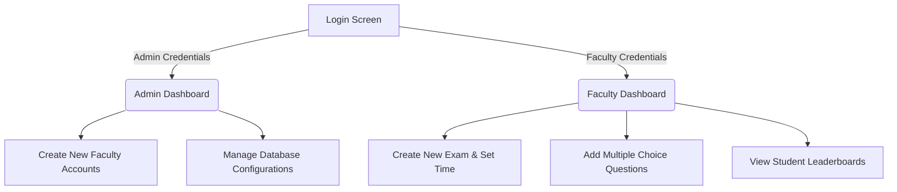
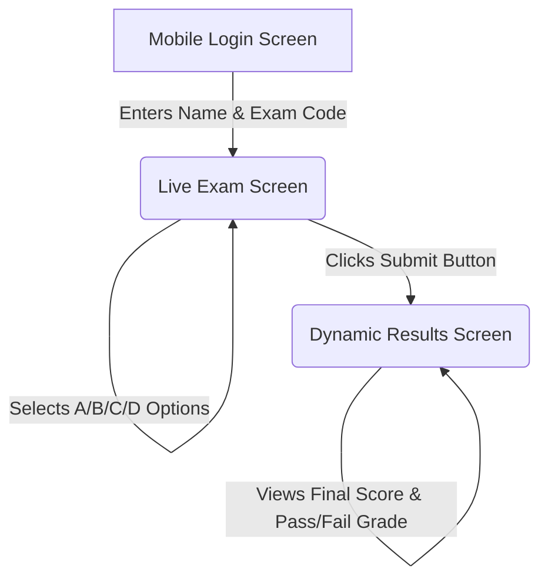

# 🚀 SecureExam: Enterprise E-Learning Architecture

SecureExam is a full-stack, dual-platform Examination Management System. It features a distributed architecture with a centralized Python RESTful API "Brain" supporting two distinct frontends: a Web Portal for Administration/Faculty and a native Cross-Platform Mobile App for Students.

---

## 🌐 Live Application Links
> **Note:** If hosting on a cloud provider like Vercel, Render, or Heroku, replace these placeholder links with your actual URLs.

- **Admin/Faculty Web Portal:** [https://secureexam-k7w2.onrender.com](https://secureexam-k7w2.onrender.com)
- **Student Mobile App (Expo):** [Insert Expo QR Code / Link Here]
- **Cloud Database Dashboard:** [TiDB Cloud Console]

---

## 🏗️ Architecture & Navigation Flow

The system is split into two distinct user flows that communicate via a shared Cloud API:

### 1. Web Portal (Admin & Faculty)


### 2. Mobile Application (Students)


---

## 💻 Technology Stack

### Frontend (User Interface)
*   **Web Portal (Admin/Faculty):** HTML5, CSS3, Vanilla JavaScript, AJAX.
*   **Mobile App (Students):** React Native, Expo, TypeScript, custom CSS modules.
*   **UI/UX Enhancements:** Custom Dark/Light mode theme switching, interactive micro-animations, Apple-style glassmorphism styling, and real-time validation alerts.

### Backend (API Server)
*   **Language:** Python 3
*   **Framework:** Flask RESTful API
*   **Security:** `pbkdf2:sha256` Cryptographic Password Hashing, Flask-CORS protection, and Parameterized SQL Queries to prevent SQL Injection.

### Database (Data Storage)
*   **Production:** TiDB Cloud (Distributed SQL highly compatible with MySQL).
*   **Local Development:** SQLite (`mcq_exam.db`) for offline network deployment.
*   **Drivers:** `PyMySQL` and native `sqlite3`.

### Automated Testing & CI/CD
*   **Frameworks:** Pytest & Selenium WebDriver (End-to-End Headless Browser Testing).
*   **Coverage:** 107 dynamically generated test cases via Matrix Parameterization.
*   **Reporting:** Custom `openpyxl` Python hook that automatically generates a color-coded Excel Dashboard UI for QA analysis.
*   **CI/CD Pipeline:** GitHub Actions workflow triggered on every push.

---

## 🛠️ Local Installation & Setup Guide

Want to run SecureExam on your own machine? Follow these simple steps:

### Prerequisites
- Install **Python 3.10+** (Ensure "Add to PATH" is checked)
- Install **Node.js LTS** (Run `winget install OpenJS.NodeJS.LTS` on Windows)
- Install **Git**

### Step 1: Clone the Repository
```bash
git clone https://github.com/Jagadesh131/SecureExam.git
cd SecureExam
```

### Step 2: Start the Web Backend
The backend powers the Faculty portal and connects to the database.
```bash
cd backend
pip install -r requirements.txt
python app.py
```
*The web portal is now live at: `http://127.0.0.1:5000`*

### Step 3: Start the Mobile Frontend
Open a **new terminal window** and navigate to the mobile app folder:
```bash
cd student_app
npm install
npx expo start
```
*Press `w` in the terminal to view the mobile app in your web browser, or scan the QR code with your phone.*

### Step 4: Run the Automated Test Suite (Optional)
To generate the Excel Testing Dashboard locally:
```bash
cd backend
python run_e2e.py
```

---

## 🎨 UI & UX Design Philosophy
SecureExam isn't just functional; it is designed with a premium, modern aesthetic:
- **Responsive Layouts:** The Web Portal seamlessly adapts to 4K monitors, laptops, and tablets.
- **Dynamic Feedback:** Instant colored toast notifications inform the user of successes or errors without jarring page reloads.
- **Cognitive Load Reduction:** The mobile app strips away all unnecessary navigation elements during the exam, focusing 100% of the screen space on the questions and a floating timer to reduce student anxiety.
- **Result Visualization:** Scores are instantly calculated and presented with dynamic color logic (Green = Pass, Red = Fail) to provide immediate, definitive feedback.
